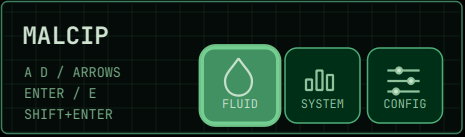
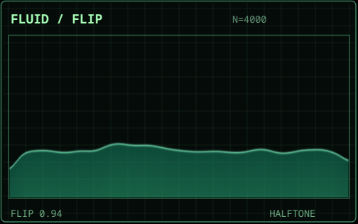
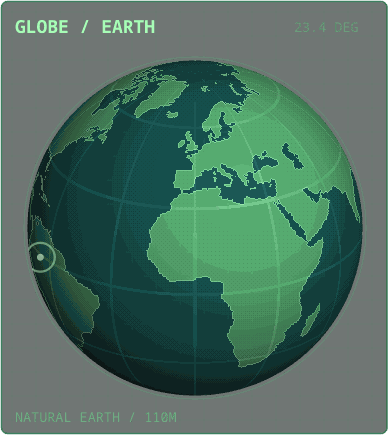
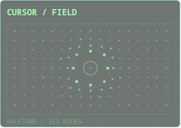
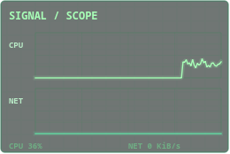

# MALCIP

**Make Arch Look Cool In Public** is a small desktop overlay for KDE Plasma and Hyprland. It uses Qt through XWayland, NumPy for the fluid simulation, and no Electron runtime.







The top center control bar uses a compact two-row grid of 50 px cells with 5 px gaps and a gliding selection frame inspired by Workspace Field. Its icons are drawn as geometry rather than emoji. Popups are transparent, click-through, and arranged at the side of the primary monitor in the order they were enabled. Closing one moves the others into place.

- **Fluid** is a particle/grid FLIP simulation rendered as a continuous water surface at physical display resolution. The pointer acts as a small solid object when it enters the water. A volume correction prevents the particle pool from gradually collapsing onto the floor. Ordered dither is limited to the surface edge.
- **System** shows live CPU, memory, and root disk usage.
- **Globe** is an automatically rotating, dithered orthographic Earth with a translucent ocean, lit land, and geographic grid. Brief radar pings appear at random visible land locations and rotate with the planet. It uses Natural Earth 110m land polygons and requires no interaction.
- **Cursor Field** is a small springy halftone lattice. Its dots bend around the pointer when it crosses the panel, then settle back into a subtle idle motion. Pointer coordinates are read relative to each XWayland window so mixed monitor scaling does not break hover effects.
- **Signal Scope** draws real CPU utilization and aggregate network throughput as two live traces. It reads local counters only; no audio or microphone access is needed.
- **Decoder** continuously scrambles hexadecimal glyphs while a narrow alignment pass locks and releases columns.
- **Block Cipher** permutes a grid of shifting tiles through fictional substitution rounds.
- **Trace** sends pulses through a changing route graph while an acquisition ring closes around it.
- **Buffer** fragments, shifts, and releases bands of synthetic memory blocks.
- **Hash Grid** sweeps a comparison window through a fading field of illuminated cells.

The five tool panels deliberately imitate cinematic computer utilities. Their numbers and operations are decorative. Moving the pointer through any tool changes its active scan position without capturing clicks.

## Install

On Arch Linux, install the runtime dependencies:

```sh
sudo pacman -S python python-pyqt6 python-numpy python-psutil python-xlib
```

Then run:

```sh
./install.sh
~/.local/share/malcip/run.sh toggle
```

`install.sh` writes only to the current user's XDG data directory. To use another Python environment, set `MALCIP_PYTHON` to its interpreter. On a Wayland session with `DISPLAY` available, the launcher selects Qt's X11 backend so XWayland can position the popups and pass clicks through them.
When MALCIP is already running, `run.sh` uses the lightweight `ctl.py` socket client; pressing the shortcut does not start a second Qt or NumPy process.

## Controls

Bind `~/.local/share/malcip/run.sh toggle` to a shortcut in KDE or Hyprland. The shortcut opens or hides **only the bar**; running popups remain visible.

While the bar is open:

| Keys | Action |
| --- | --- |
| Arrow keys or A/D | Move the gliding selection frame through the grid |
| Enter or E | Activate the selected cell |
| 1/F, 2/S, 3/G, 4/C, 5/V | Toggle Fluid, System, Globe, Field, or Scope directly |
| 6, 7, 8, 9, 0 | Toggle Decoder, Cipher, Trace, Buffer, or Hash Grid |
| Shift+Enter | Open config |
| R | Reset fluid |
| H | Toggle surface dither |
| Escape | Hide the bar |

The cells also respond to mouse clicks. Config controls particle count, FLIP/PIC blend, dither, cinematic-tool speed, panel background opacity, popup spacing, and left/right placement. A `MALCIP_SCREEN` environment variable can select a display by its Qt screen name.
Popups wrap into additional columns if the monitor is too short.

For Hyprland, one possible binding is:

```ini
bind = SUPER SHIFT, P, exec, ~/.local/share/malcip/run.sh toggle
```

The display-only popups use unmanaged, click-through tooltip windows. The keyboard-focused bar requests XWayland's skip-taskbar and skip-pager states before it appears.

## Current scope

This is an early MALCIP release. The FLIP surface uses a shared height histogram instead of one percentile calculation per column, and the globe caches projection geometry between frames. At 4,000 particles and 1.5× display scaling, a local 90-frame measurement found a 7.0 ms median for FLIP simulation plus rendering and 3.4 ms for globe rendering at 336 × 336 physical pixels. Qt painting, compositor latency, and other system load add to those times.

MIT licensed. See [LICENSE](LICENSE). Natural Earth globe data is public domain; see [DATA_LICENSE.md](DATA_LICENSE.md).
